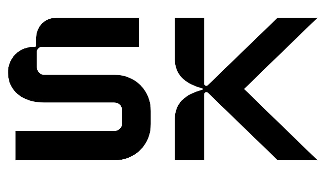

# Muhammad Suleman Khetran
[](https://visitcount.itsvg.in)
<!--  -->

     
   <!-- 
    -->


<!-- termynal -->

```
# In a nutshell
$ Muhammad_Suleman_Khetran --help
Description:
  An automation engineer with extensive R&D experience in
  data engineering and control systems
Options:
  -h, --help                 Can help in OpenCV projects, programming 
                             PLCs and commissioning of industries.

  -d, --domain               Programming, IoT, ERP, and MES frameworks.

  -e, --expertise            Standalone projects, PLCs, electronics
                             circuits and commissioning.

  -v, --Version              5+ years of R&D and Industrial experience
                             in programming PLCs, SCADA,
                             HMIs, and motor drivers
```

<!-- ## In a nutshell
An automation engineer with extensive R&D experience in `data engineering` and control systems, skilled in IoT, ERP, and MES frameworks. Expertise in programming `PLCs` and commissioning of industries. Proficient in Python, C++,, JavaScript, and more, with 5+ years of experience in PLCs, SCADA, HMIs, and motor drivers. -->


💬 Ask me about: `industrial commisioning, machine learning or OpenCV.`

📫 How to reach me:   [](mailto:suleman.0101@gmail.com)


## 💻Tech Stack

| Language | Frameworks| Hostings|Server & DevOps| DataBases| Design| Libraries|
|----------|----------|----------|----------|------|-------|-------|
     ||   | |    |  |   |

<!-- ## Hands on experience
PLC, HMI and SCADA -->
### _OS & IDEs_


## Projects

- Developing Nexus, the cross-platform, all-in-one, CharaChorder desktop app!

Roles & Responsibilities:

- Leading the Certified Technology Apps Development and Quality Engineering Team
- Mentoring and training Developers and Quality Engineers
- Planning and deciding the product roadmap

Milestones Led:

- Revamped Container, Helm Chart, Openshift, and Openstack software certifications
- Revamped Red Hat partner onboarding flow and account management
- Red Hat Enterprise Linux 8,9 certification
- Openshift 4.11, CNI, CSI, CSF certification
- Openstack certification
- Red Hat Partner SFTP
- Multiarch Container Certification

```
Disclosed soon
```


### Activities

<!-- 🌞 Morning  
🌆 Daytime  
🌃 Evening  
🌙 Night    -->

🕑︎ Time Zone: Asia/Istanbul 

#### 💬 Daily spent time:

| Language | Time | Percentage | Data |
|----------|----------|----------|----------|
Python   |   2 hrs 54 mins | ██████████░░░░░░░░░░░░░░░ |  40.81 %|    
C++      |   2 hrs 29 mins | █████████░░░░░░░░░░░░░░░░ |  34.89 %|   
C        |  29 mins        | ██░░░░░░░░░░░░░░░░░░░░░░░ |  07.00 %|   
JSON     |  20 mins        | █░░░░░░░░░░░░░░░░░░░░░░░░ |  04.81 %|   
Bash     |  15 mins        | █░░░░░░░░░░░░░░░░░░░░░░░░ |  03.72 %| 

#### 🐱‍💻 Projects: 

| Project | Time | Percentage | Data |
|---------|------|-----------|-------|
swarm_mission | 3 hrs 32 mins |  ████████████░░░░░░░░░░░░░|   49.65 % |    
sybilis       | 2 hrs 53 mins |  ██████████░░░░░░░░░░░░░░░|   40.47 % |   
wardn         | 15 mins       |  █░░░░░░░░░░░░░░░░░░░░░░░░|   03.65 % |   
omakub        | 14 mins       |  █░░░░░░░░░░░░░░░░░░░░░░░░|   03.28 % |   
swarm_mocks   | 12 mins       |  █░░░░░░░░░░░░░░░░░░░░░░░░|   02.84 % |   

```
From: 16 July 2020 - To: 15 June 2024

Total Time: 1,679 hrs 31 mins
```


[Next](/About){ .md-button }


### Where to find me

[](https://github.com/suleman-khetran#where-to-find-me)

[](https://github.com/suleman-khetran) [](https://twitter.com/Suleman0101) [](https://www.linkedin.com/in/Suleman0101)


<!-- [Back](/About){ .md-button } -->


To the extent possible under law, [Suleman Khetran](https://suleman-khetran.github.io/) has waived all copyright and related or neighboring rights to this work.


<!--  -->

<!--  -->

<!-- {: style="height:30px;width:50px" } -->

<!-- (https://github.com//github-profile-trophy) -->


<!-- ## License

**Released under [MIT](/LICENSE) by [@suleman-khetran](https://github.com/suleman-khetran).** -->

<!-- `_Social buttons_ ` -->

<!-- https://github-profile-trophy.vercel.app/?username=suleman-khetran&rank=S,AAA -->
<!-- Analytical, energetic, and detail-oriented automation engineer worked in R&D department for `data engineering` and `industrial control system` integrated with ERP and MES systems. Expert in `programming`, `industrial commissioning` and testing of automatic robotic car parking system and payment management system. **4+** years of experience in Python, C++, .Net, JavaScript, Delphi, SQL, Lua, Docker and NodeJS. Experience in PLC (Siemens S-7, Delta, Lenze, Beckhoff, GMT), SCADA (self-created through OPC using Python and JavaScript), HMI (Lenze p300, Delta DOP-107BV, Siemens KTP700), Motor Driver (Siemens, Delta, Lenze). Aspire to contribute expertise in the programming and automation field. -->
<!-- [](https://github.com/ryo-ma/github-profile-trophy) -->

<!-- 🔭 I’m currently working on machine learning, computer vision and deep learning projects.
🌱 I’m currently learning deep learning and Natural Language Processing.
👯 I’m looking to collaborate on AI projects and AI research.
🤔 I’m looking for help with my Deep Learning research.
💬 Ask me about machine learning, OpenCV or deep learning.
📫 How to reach me: hemrajdhakal.ml@gma -->
